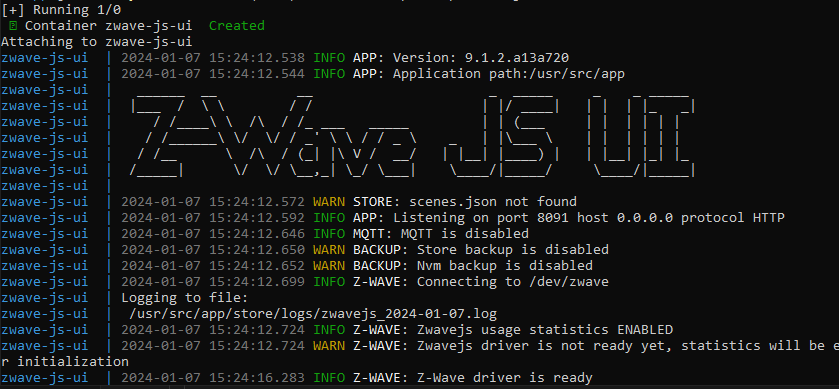
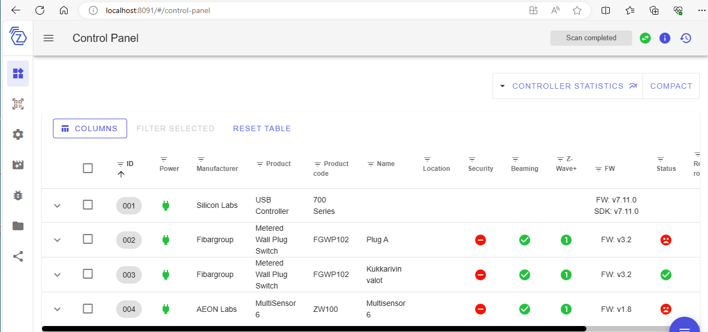
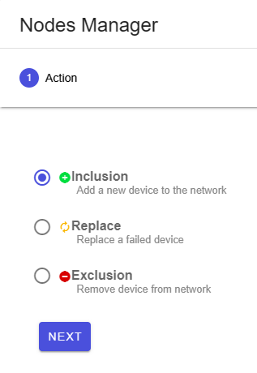

# My ZWave

This used to be called "MyHomeAssistant", but I have the feel HA is not really welcome in the equation. I just need it for scheduling, and it comes with ... so much. :/

Thus changing the title.

Running [Home Assistant](https://www.home-assistant.io) within Docker, under Windows 10 Home.

## Design criteria

### Safety

I don't want to give the Docker container `privileged: true` rights (i.e. ability to do anything
with the host Windows), or `networking: host` for that matter, either.

Instead, we bridge the dongle to WSL using USB/IP. ZWave-JS-UI takes care of handling the peripherals.

### Persistence

`./store` folder is used for the state of `zwave-js-ui`, so that is on the WSL file system instead of within the container.

## Requires

- WSL2 (requirement also for Docker)
- [`usbipd-win`](https://github.com/dorssel/usbipd-win) installed


## Steps (ZWave JS UI)

1. Expose Z-Wave dongle to WSL

   I'm using [Silicon Labs UZB-7](https://www.silabs.com/development-tools/wireless/z-wave/efr32zg14-usb-7-z-wave-700-stick-bridge-module) 

   In Admin command line:

   ```
   PS> usbipd list
   Connected:
   BUSID  VID:PID    DEVICE                                                        STATE
   3-1    10c4:ea60  Silicon Labs CP210x USB to UART Bridge (COM4)                 Not shared
   [...]
   ```

   ```
   PS> usbipd bind -b 3-1
   ```

   ```
   PS> usbipd attach --wsl -b 3-1
   usbipd: info: Using WSL distribution 'Ubuntu' to attach; the device will be available in all WSL 2 distributions.
   usbipd: info: Using IP address 172.25.32.1 to reach the host.
   ```

   Within WSL, see that the device is seen:

   ```
   $ lsusb
   Bus 001 Device 002: ID 10c4:ea60 Silicon Labs CP210x UART Bridge
   [...]
   ```

2. Launch the Docker container

   ```
   $ docker compose up zwave-js-ui
   ```

      

   Leave the software running.

3. Open [localhost:8091](http://localhost)

   
   
   >In Z-Wave, the controller remembers the devices it's been paired with.

## Steps (Home Assistant)

ZWave-JS-UI doesn't seem to provide any means for scheduling actions (e.g. switching on/off power at certain times). We may need Home Assistant just for that.

```
$ docker compose up home-assistant
```

Open [localhost:8123](http://localhost:8123).


## Appendices

Things to help. Notes.

## Usability hint

The hamburger menu at lower right corner **changes based on which left-side tab you're on!!** This may be confusing at best.

## Adding devices

To add a device:

- Select "Control panel" (default view) from left tab
- Open `☰` > `Manage nodes`

   

- Enter the names; triple-click the device once the UI waits for inclusion. Should be fast and clear.


## References

- Home Assistant docs > Alternative > [Docker Compose](https://www.home-assistant.io/installation/alternative/#docker-compose)

- [Installing Home Assistant on Docker, Docker Compose and Portainer](https://www.youtube.com/watch?v=3ayI--eot4o) (Youtube, Aug 2022; 10:33)

